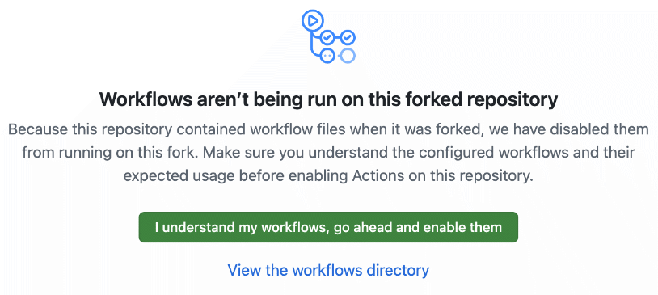

# Small Workflow to Post/Pre-Process OCR'd Texts for Papyri

(*This is specific to one project and its OCR model.*)

> Workflow: 
> Add files to `/in` -> .github/workflows triggers `script/prepyri.py` -> creates new file in `out` & appends log in `/log` & moves the input files to `/archive`.

## Features
- **Simple Markup Replacements**

| Character | Replacement |
| --- | ---|
| ⳨ | \*rho-cross\* |
| \+ | \*stauros\* |
| ·  | \*middot\* |
| ⳿ | \*word-sep-apostrophe\* |
| ⲓ̈ |  ⲓ(¨) |
| : | \*dipunct\* |

- **Handling Square Brackets** 
Auto-closes open Brackets and adds '.?'.  
*Abbreviations with hyphen and new line are not caught correctly.*

- **Abbreviations** 
Auto-surrounds with Brackets. 
*Does not catch cases of multiple '/'.*

- **Auto-move Hyphens** 
Moves Hyphens to next line. Introduces 'new line' when a hyphen ends the fragment.

- **Counting Dots** 
Counts Dots. 
*Whitespaces sometimes break this. Try to avoid whitespaces between dots.*

- **Line Numbering** 
Line numbering based of the markers included. 
Ie. it will look for a number and count up/down. When a text has line numbers 'below' zero a warning will be added to the log. 
*This feature sometimes breaks with comments between the lines.*

- **Logging** 
Upon each iteration of the workflow there will be logs (either appended to the log of the day or creating a new one) showing 'warnings' and the first couple lines of the `.txt` after the different steps of the script.

> [!IMPORTANT] 
> This will not replace going over the text again, but it might make it a bit faster to do so.

---

## Setup

(If you do not have a GitHub account create one first.)

Then 'fork' (*ie. create your own editable copy*) the repository by pressing `Fork`. 
Select any name and keep the settings.

By default GitHub will not activate the 'actions' feature. 
Thus head over to the `Actions` tab.

Here you simply enable the workflows.
Whenever you add new files to `./in` the workflow will run now. 
